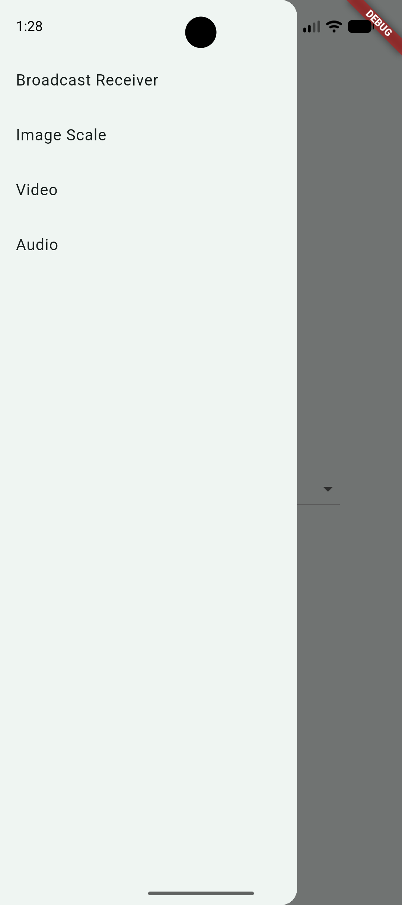
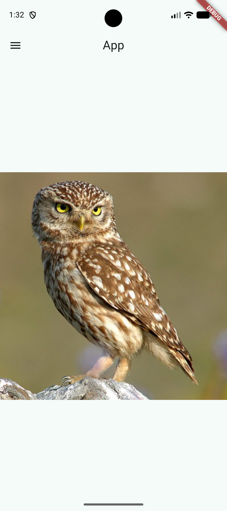

# MediaHub

MediaHub is a Flutter practice application that brings together common device and media experiences in one lightweight interface. Use the navigation drawer to explore broadcast receivers, image scaling, video playback, and audio playback.

## Features

- **Broadcast receivers**: choose between a custom broadcast receiver and a system battery notification receiver.
- **Image scaling**: view a bundled image while experimenting with image presentation and scaling behavior.
- **Video playback**: play the included sample video with a seek bar, elapsed and remaining time, playback controls, and volume control.
- **Audio playback**: play the included sample audio with progress tracking and standard playback controls.
- **Material 3 interface**: a simple drawer-based layout built with Flutter's Material components.

## Screenshots

|               Navigation drawer                |                    Broadcast receiver                     |
| :--------------------------------------------: | :-------------------------------------------------------: |
|  |  |

|                   Image scaling                   |                   Video playback                   |
| :-----------------------------------------------: | :------------------------------------------------: |
|  |  |

## Tech Stack

- [Flutter](https://flutter.dev/)
- Dart
- [`video_player`](https://pub.dev/packages/video_player)
- [`audioplayers`](https://pub.dev/packages/audioplayers)
- [`battery_plus`](https://pub.dev/packages/battery_plus)
- Material 3

## Getting Started

### Prerequisites

- Flutter SDK with Dart SDK `3.13.1` or compatible
- Android Studio, Xcode, or another configured Flutter target
- A connected device or emulator

### Installation

```bash
git clone <repository-url>
cd MediaHub
flutter pub get
flutter run
```

The sample media files are bundled with the project, so no additional content download is required:

- `assets/media/sample_video.mp4`
- `assets/media/sample_audio.mp3`

## Project Structure

```text
lib/
├── main.dart                         # Application entry point
├── screens/
│   ├── home_screen.dart               # Drawer navigation and page selection
│   ├── audio_page.dart                # Audio playback experience
│   ├── image_scale_page.dart          # Image scaling experience
│   ├── video_page.dart                # Video playback experience
│   └── broadcast/                     # Broadcast receiver screens
└── services/
	└── broadcast_channel.dart         # In-app broadcast stream
```

## Development Commands

```bash
flutter analyze
flutter test
flutter run
```
