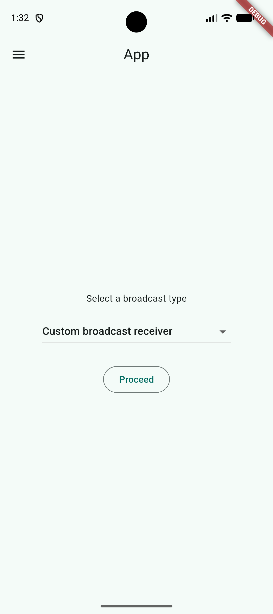
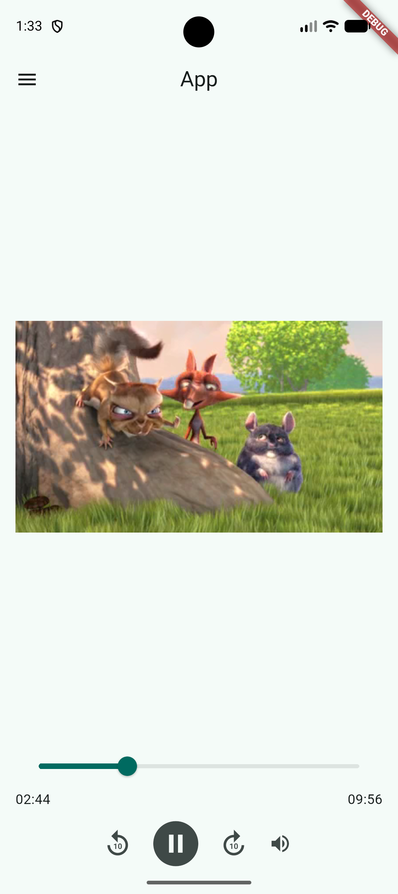

<div align="center">

# Flutter Practice Projects

Practical Flutter applications built to explore mobile UI patterns, device capabilities, media playback, and reusable application logic.

</div>

## Projects

| Project                   | Description                                                   | Main concepts                                                                      |
| ------------------------- | ------------------------------------------------------------- | ---------------------------------------------------------------------------------- |
| [MediaHub](MediaHub/)     | A drawer-based media and device experience app.               | Audio playback, video playback, image scaling, broadcast receivers, battery status |
| [VangtiChai](VangtiChai/) | A Bangladeshi Taka change calculator with responsive layouts. | Keypad input, denomination calculation, reusable widgets, orientation support      |

Each project is an independent Flutter application with its own `pubspec.yaml`, platform folders, assets, and tests.

## Project Screenshots

### MediaHub

<table>
  <tr>
    <td align="center"><strong>Broadcast receiver</strong><br></td>
    <td align="center"><strong>Video playback</strong><br></td>
  </tr>
</table>

### VangtiChai

<table>
  <tr>
    <td align="center"><strong>Portrait layout</strong><br></td>
    <td align="center"><strong>Landscape layout</strong><br></td>
  </tr>
</table>

## Requirements

- [Flutter SDK](https://docs.flutter.dev/get-started/install)
- Dart SDK compatible with the individual project constraints:
  - **MediaHub:** Dart `^3.13.1`
  - **VangtiChai:** Dart `^3.12.2`
- A configured Flutter target, such as an Android emulator, iOS simulator, desktop device, or web browser

Check your local setup with:

```bash
flutter doctor
```

## Getting Started

Clone the repository, choose an application, install its dependencies, and run it:

```bash
git clone <repository-url>
cd Flutter-Practice-Projects/<project-directory>
flutter pub get
flutter run
```

Replace `<project-directory>` with `MediaHub` or `VangtiChai`.

### Run MediaHub

```bash
cd MediaHub
flutter pub get
flutter run
```

MediaHub includes its sample media locally, so no separate content download is required. The bundled files are located at:

```text
MediaHub/assets/media/sample_video.mp4
MediaHub/assets/media/sample_audio.mp3
```

### Run VangtiChai

```bash
cd VangtiChai
flutter pub get
flutter run
```

VangtiChai supports portrait and landscape layouts and calculates change using denominations of 500, 100, 50, 20, 10, 5, 2, and 1 Taka.

## Development Commands

Run these commands from the directory of the application you are working on:

```bash
flutter analyze
flutter test
flutter run
```

To run a specific test file:

```bash
flutter test test/change_calculator_test.dart
```

## Repository Structure

```text
Flutter-Practice-Projects/
├── MediaHub/
│   ├── assets/             Bundled audio and video files
│   ├── lib/                Application source code
│   ├── test/               Widget tests
│   └── pubspec.yaml        MediaHub dependencies and assets
├── VangtiChai/
│   ├── Images/             Application screenshots
│   ├── lib/                Screens, widgets, constants, and utilities
│   ├── test/                Calculator and widget tests
│   └── pubspec.yaml        VangtiChai dependencies
└── README.md               Repository overview
```

## Documentation

More detailed feature descriptions, screenshots, project structure notes, and setup instructions are available in each application’s README:

- [MediaHub documentation](MediaHub/README.md)
- [VangtiChai documentation](VangtiChai/README.md)

## License

This repository is intended for learning and practice. No license has been specified yet.
